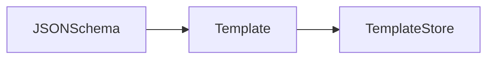
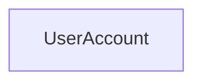
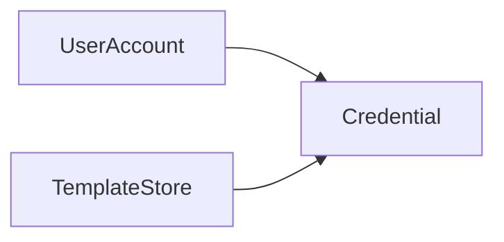
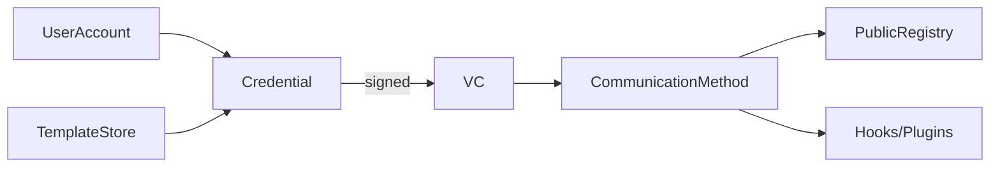

# Action Flows

The UI application facilitating interaction between the issuers, holders, verifiers and requesters has 8 primary Action Flows. In the context of this document, an Action Flow refers to how a particular Action taken at the frontend translates to the backend in order to propagate changes across systems.

- [ ] [Creating an Account](#creating-an-account)
- [ ] [Creating a Template](#creating-a-template)
- [ ] [Issuing a New Verifiable Credential (VC) - Issuer](#issuing-a-new-verifiable-credential-vc)
- [ ] [Fetching / Updating Verifiable Credential (VC) Holder](#fetching--updating-verifiable-credential-vc)
- [ ] [Verification of a Verifiable Credential (VC) / Verifiable Presentation (VP)](#verification-of-a-vc-or-vp)
- [ ] [Requesting for a Verifiable Presentation (VP)](#requesting-for-a-verifiable-presentation-vp)
- [ ] [Fetching / Updating Requests](#fetching--updating-requests)
- [ ] [Accepting a Request and generating Verifiable Presentation (VP)](#accepting-a-request-and-generating-vp)

For a more visual representation of these flows take a look at the [Whimsical Flowcharts](https://whimsical.com/complete-architecture-c4gt-3XeGvXT3836A9xGbB9hrWg), [Verifiable Credentials Data Model v1.1](https://www.w3.org/TR/vc-data-model) and [this Github Repository](https://github.com/verifiable-presentation/spec)

## Creating an Account

In order to make the Competency Passbook interoperable across a variety of platforms as well as to place the control of data in the User's hands itself, a local keystore is created whenever a User Signs Up for a new account.

This keystore consists of the ```private``` and ```public``` keys required in order to sign and verify credentials/presentations respectively. The first few characters of the public key can also be used as a Public Identifier ```(pubID)``` for the given user account. This would help us reduce complexity in terms of mapping a user's public ID to their public key.

All the VCs and VPs issued by the user are stored locally and never go beyond the local environment of the user's device thereby making the user, the true owner of their data.

## Creating a Template

A template is created in the form of a JSON file containing fields which need to filled in order to create a Verifiable Credential.

```json
{
  "@context": [
    "https://www.w3.org/2018/credentials/v1",
    "https://www.w3.org/2018/credentials/examples/v1"
  ],
  "type": ["VerifiableCredential", "AlumniCredential"],
  
  "_id": "http://example.edu/credentials/58473",
  "_issuer": "https://example.edu/issuers/565049",
  "_issuanceDate": "2010-01-01T00:00:00Z",
  "_credentialSubject": {
    "id": "did:example:ebfeb1f712ebc6f1c276e12ec21",
    "alumniOf": {
      "id": "did:example:c276e12ec21ebfeb1f712ebc6f1",
      "name": [
        {
            "value": "Example University",
            "lang": "en"
        }, 
        {
            "value": "Exemple d'Université",
            "lang": "fr"
        }
      ]
    }
  },
}
```

The JSON fields starting with an underscore ```(_)``` are the ones which are to be provided while issuing the VC. The fields which do not start with an underscore are permanent in nature and remain the same for every instance of the VC template.

- **Template Verification :** After a template has been pushed to the template registry / template-store, it is now available for issuing VCs. But, in case of templates which contain within themselves sensitive information, it is important for them to be verified by trusted authorities. A trusted authority can sign the template in order to enforce authenticity and trust and push them back to the template store.



## Issuing a new Verifiable Credential (VC)

Once the template has been pushed to the template store and signed or approved by an authority (optional), the issuer can go ahead and issue a VC to a particular holder. It is to be noted that the template store from which templates are fetched in order to create a VC can either be a global public registry (in which case everyone can use each others templates) or it can be a private registry maintained by a single sovereign entity (in which case the sovereign entity is responsible for the maintenance of the registry)

Action Flow for Issuing a new VC ```(Issuer)```

Every user account has a local encrypted json file(s) which store the users identity in the network. The json data can be simple represented with something like

```json
{
    "name": "<Name / Identifier of Holder>",
    "publicId": "<Public ID of Holder>",
    "keystore" : {
        "pubKey": "<Public Key of Holder>",
        "priKey": "<Private Key of Holder>"
    }
}
```



The issuer selects a template from the available templates in the template store and fills out the required data via the interactive UI.

```json
{
  "@context": [
    "https://www.w3.org/2018/credentials/v1",
    "https://www.w3.org/2018/credentials/examples/v1"
  ],
  "id": "http://example.edu/credentials/3732",
  "type": ["VerifiableCredential", "UniversityDegreeCredential"],
  "issuer": "https://example.edu/issuers/565049",
  "issuanceDate": "2010-01-01T00:00:00Z",
  "credentialSubject": {
    "id": "did:example:ebfeb1f712ebc6f1c276e12ec21",
    "degree": {
      "type": "BachelorDegree",
      "name": "Bachelor of Science and Arts"
    }
  }
}
```



The issuer then signs this generated VC with its private key from the local keystore and adds it to the ```proof``` field of the JSON Credential.

```json
{
  "@context": [
    "https://www.w3.org/2018/credentials/v1",
    "https://www.w3.org/2018/credentials/examples/v1",
    "https://w3id.org/security/suites/ed25519-2020/v1"
  ],
  "id": "http://example.edu/credentials/3732",
  "type": [
    "VerifiableCredential",
    "UniversityDegreeCredential"
  ],
  "issuer": "https://example.edu/issuers/565049",
  "issuanceDate": "2010-01-01T00:00:00Z",
  "credentialSubject": {
    "id": "did:example:ebfeb1f712ebc6f1c276e12ec21",
    "degree": {
      "type": "BachelorDegree",
      "name": "Bachelor of Science and Arts"
    }
  },
  "proof": {
    "type": "Ed25519Signature2020",
    "created": "2022-02-25T14:58:42Z",
    "verificationMethod": "https://example.edu/issuers/565049#key-1",
    "proofPurpose": "assertionMethod",
    "proofValue": "z3FXQjecWufY46yg5abdVZsXqLhxhueuSoZgNSARiKBk9czhSePTFehP
8c3PGfb6a22gkfUKods5D2UAUL5n2Brbx"
  }
}
```



This generated VC is then transferred to the holder via a communication channel. There are 2 major channels which can be used in this case

- **Hooks / Plugins :** We can send the generated credential via a medium such as Email, WhatsApp, Telegram, etc. The Holder can download the file, and load it into the application. The application automatically saves the credential and looks for updates.

  - **Note :** Every credential created using a hook must have an updateLink which should enable queries of the form ```GET /updates?id={id}``` in order to check for updates. In case such as link is not available, the app will not search for any updates related to the given VC.

- **Public Registry :** The credential can also be saved on a public registry / database against the public ID of the user. This can be thought of as a ```PubSub model``` where credentials are published to the registry, and the users (who are subscribers to the registry) periodically check for new updates.

  - **Note :** The app regularly checks for any new VC or any updated VC against the publicID of the holder. Updates are checked by comparing the previous and latest signatures. If they are different, it indicates a change in data, and hence the new VC is automatically downloaded.

## Fetching / Updating Verifiable Credential (VC)

Once a VC has been issued under the Public ID of a particular user, it needs to be fetched. Previously fetched VCs also need to be checked periodically for possible updates.

The two possible data sources via which this can be done has been described towards the end of the [Issuing a new Verifiable Credential (VC)](#issuing-a-new-verifiable-credential-vc) section.

Once the VC has been fetched, the credential's signature is verified and it is ensured that it has been issued by the genuine issuer. For more details on how signatures are verified, you can check out the [Verification of a VC or VP](#verification-of-a-vc-or-vp) section.

Once the signature is verified, the JSON data is fetched and written to the local storage of the user's device where it persists for future use and creation of Verifiable Presentations.

## Verification of a VC or VP

The proof section of a VC or VP shall also contain the public key or URL to the public key to be used in order to verify the authenticity of the signature present in the JSON object.

A verifier node simply caches the public keys which it receives during verification requests. It then uses this public key along with the signature passed in the request to verify that the signature was indeed signed by the right signer (issuer).

After verification it then simply returns the verification status of the Credential / Presentation which could be one of the following

- **Verified Document :** The public key was successfully fetched and used to verify that the signer was indeed the issuer itself.

- **Unable to Verify Document :** In case the public key was given as a URL, and could not be fetched or decoded properly, it would be unclear as to whether the document is actual authentic or not. Hence this status is returned when the system is unable to determine the authenticity of a VC or VP.

- **Tampered Document :** In case the public key was successfully fetched but the signature is not authentic.

## Requesting for a Verifiable Presentation (VP)

Once VCs have been issued, fetched, verified and added to the competency passbook of a holder, there needs to be a way for other 3rd parties to access / request for this specific data in a safe and secure manner.

Let’s suppose a company would like to extend an internship offer to a student. In order to create the offer letter and register the student in their database they require specific details from multiple documents. For example: Aadhar Card Number, PAN Card Number, etc

The Requester, looks for the official and verified JSON Aadhar VC template in the template store. This allows the requester to know which type of data is available with the holder of the VC. The requester then creates a request containing the specific fields from specific VCs which they need access to. This request is then signed using their private key.

In order to ensure better safety, the requester can also add a verification link to the VP request. We can have a central database that stores a list of all the verified requesters. This will allow people to trust only the requests which come from verified requesters.

A sample Proof Of Concept Request for data can look something like this

```json
{
  "requesterPubID" : "<Public ID of Requester>",
  "requestID" : "<Request ID>",
  "verificationLink" : "<To verify Requester> (optional)",
  "pubKey" : "<Requester Public Key",
  "request" : [
    {
      "vcID" : "<ID of VC as in Public Registry>",
      "vcName" : "<VC Name / Identifier>",
      "direct" : ["<List of direct data fields>"],
      "derieved" : ["<List of derieved data fields>"]
    },
    {
      "vcID" : "<ID of VC as in Public Registry>",
      "vcName" : "<VC Name / Identifier>",
      "direct" : ["<List of direct data fields>"],
      "derieved" : ["<List of derieved data fields>"]
    },
    ...
  ],
  "proof" : {
    "type": "RsaSignature2018",
    "created": "2017-06-18T21:19:10Z",
    "proofPurpose": "assertionMethod",
    "verificationMethod": "https://example.edu/issuers/565049#key-1",
    "jws": "eyJhbGciOiJSUzI1NiIsImI2NCI6ZmFsc2UsImNyaXQiOlsiYjY0Il19..TCYt5X
      sITJX1CxPCT8yAV-TVkIEq_PbChOMqsLfRoPsnsgw5WEuts01mq-pQy7UJiN5mgRxD-WUc
      X16dUEMGlv50aqzpqh4Qktb3rk-BuQy72IFLOqV0G_zS245-kronKb78cPN25DGlcTwLtj
      PAYuNzVBAh4vGHSrQyHUdBBPM"
  }
}
```

The ```direct``` JSON field here represents the fields are directly returned from the VC such as the name of the individual. The ```derieved``` field on the other hand is used for getting boolean values in which the data is not required to be shared directly. For example in order to check whether a given person is above the age of 18 or not, rather than returning the age, we can simply return ```True / False```. This way only the precise amount of information is shared and no unnecessary information is exposed.

Once a request is made it is communicated to the holder via the same modes (either public registry or Hooks / Plugins)

## Fetching / Updating Requests

Fetching and updating of requests are done in a similar way to that of VCs, i.e. either via a Public Registry (could also be Private) or via Hooks / Plugins. Both of these methods have been explained in detail under the [Issuing a new Verifiable Credential (VC)](#issuing-a-new-verifiable-credential-vc) and the [Fetching / Updating Verifiable Credential (VC)](#fetching--updating-verifiable-credential-vc) sections. Requests shall also be fetched / updated in a similar manner.

## Accepting a Request and generating VP

Once a request has been fetched and loaded into the app by the holder, the Verifiable Presentation (VP) generation begins. The client side application check the details which have been requested by the requester. In case highly sensistive data has been requested, it is mandatory for the requester to be verified (this is checked while loading the request into the application).

The client side application then decrypts the JSON data related to the VCs stored locally, using the account holders private key (from the local keystore) and forms the required Verifiable Presentation (VP).

```json
{
  "@context": [
    "https://www.w3.org/2018/credentials/v1",
    "https://www.w3.org/2018/credentials/examples/v1"
  ],
  "type": "VerifiablePresentation",
  
  "verifiableCredential": [{
    "@context": [
      "https://www.w3.org/2018/credentials/v1",
      "https://www.w3.org/2018/credentials/examples/v1"
    ],
    "id": "http://example.edu/credentials/1872",
    "type": ["VerifiableCredential", "AlumniCredential"],
    "issuer": "https://example.edu/issuers/565049",
    "issuanceDate": "2010-01-01T19:23:24Z",
    "credentialSubject": {
      "id": "did:example:ebfeb1f712ebc6f1c276e12ec21",
      "alumniOf": {
        "id": "did:example:c276e12ec21ebfeb1f712ebc6f1",
        "name": [{
          "value": "Example University",
          "lang": "en"
        }, {
          "value": "Exemple d'Université",
          "lang": "fr"
        }]
      }
    },
    "proof": {
      "type": "RsaSignature2018",
      "created": "2017-06-18T21:19:10Z",
      "proofPurpose": "assertionMethod",
      "verificationMethod": "https://example.edu/issuers/565049#key-1",
      "jws": "eyJhbGciOiJSUzI1NiIsImI2NCI6ZmFsc2UsImNyaXQiOlsiYjY0Il19..TCYt5X
        sITJX1CxPCT8yAV-TVkIEq_PbChOMqsLfRoPsnsgw5WEuts01mq-pQy7UJiN5mgRxD-WUc
        X16dUEMGlv50aqzpqh4Qktb3rk-BuQy72IFLOqV0G_zS245-kronKb78cPN25DGlcTwLtj
        PAYuNzVBAh4vGHSrQyHUdBBPM"
    }
  }],
}
```

The presentation is then signed, and the ```proof``` section is added to the JSON object making it verifiable.

```json
{
  "@context": [
    "https://www.w3.org/2018/credentials/v1",
    "https://www.w3.org/2018/credentials/examples/v1"
  ],
  "type": "VerifiablePresentation",
  
  "verifiableCredential": [
    "<List of Verifiable Credentials>"
  ],
  
  "proof": {
    "type": "RsaSignature2018",
    "created": "2018-09-14T21:19:10Z",
    "proofPurpose": "authentication",
    "verificationMethod": "did:example:ebfeb1f712ebc6f1c276e12ec21#keys-1",
    
    "challenge": "1f44d55f-f161-4938-a659-f8026467f126",
    "domain": "4jt78h47fh47",
    "jws": "eyJhbGciOiJSUzI1NiIsImI2NCI6ZmFsc2UsImNyaXQiOlsiYjY0Il19..kTCYt5
      XsITJX1CxPCT8yAV-TVIw5WEuts01mq-pQy7UJiN5mgREEMGlv50aqzpqh4Qq_PbChOMqs
      LfRoPsnsgxD-WUcX16dUOqV0G_zS245-kronKb78cPktb3rk-BuQy72IFLN25DYuNzVBAh
      4vGHSrQyHUGlcTwLtjPAnKb78"
  }
}
```

Since the VP contains sensitive user data, it is important to make sure that it is not decipherable. We do this by simply encrypting the JSON object using the requester's public key. Once sent, the requester can easily fetch the details and decrypt it using their private key only.

```json
{
  "type" : "requestGrant",
  "data" : "<encrypted-data>",
  "timestamp" : "23:01:45T00:00:00",
  "VPRequest" : "<original request in JSON format>",
  "signature" : "<signature of this new JSON object>"
}

----------------------------------------------
Note: Signature is done by the account holder.
```

Fetching and updating of data after granting a request by the requester is done in a similar way to that of VCs, i.e. either via a Public Registry (could also be Private) or via Hooks / Plugins. Both of these methods have been explained in detail under the [Issuing a new Verifiable Credential (VC)](#issuing-a-new-verifiable-credential-vc) and the [Fetching / Updating Verifiable Credential (VC)](#fetching--updating-verifiable-credential-vc) sections. Request Grants shall also be fetched / updated in a similar manner.

These presentations are stored locally and regularly checked for updates. The account holder who granted the request has the ability to revoke the validity of the presentation after which the data can no longer be used.
