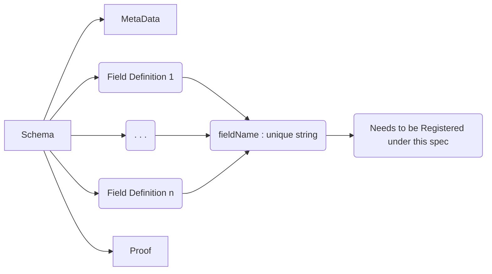
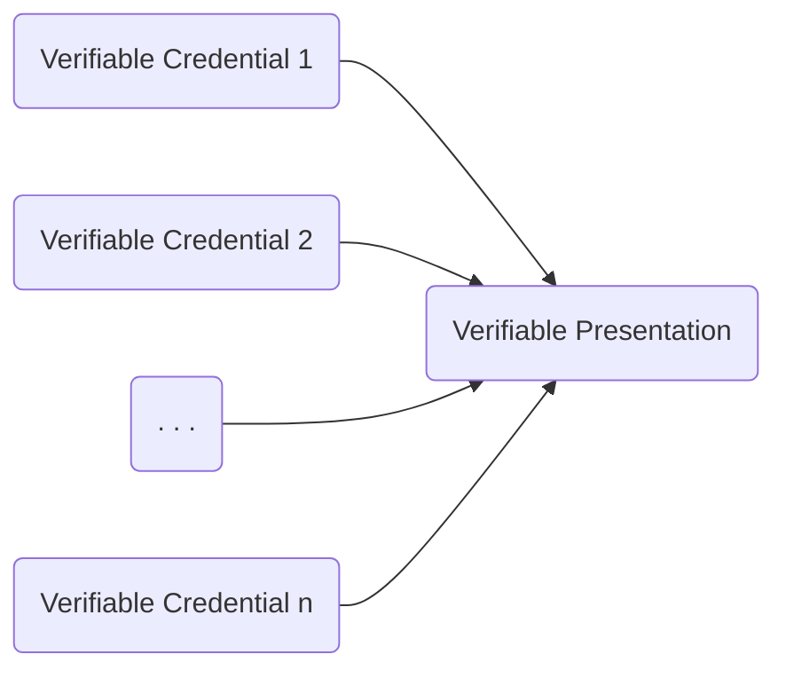
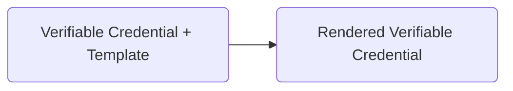

# Presentation Request

## Pre-Requisites

### Schema

A Schema is defined by the fields which are to be contained in the Verifiable Credential (VC) thereby representing some information about the holder / subject. It can be thought of as a kind of json template which is later filled with data (during the process of issuing of a VC).

A Schema is defined in the form a Python Dictionary Object which contains a :
- [x] ```metaData``` key, containing some general and specific information about the VC
- [x] ```fields``` key, containing a list of fields which need to be filled while issuing a VC.
- [x] ```proof``` key, containing cryptographic proof to verify the creator of the Schema if required.



### Verifiable Credential (VC)

The detailed structure of a VC and associated Action Flows have already been discussed and expanded upon [here](https://github.com/Samagra-Development/competency_passbook/blob/main/dev-docs/Action%20Flows.md).


### Verifiable Presentation (VP)

The detailed structure of a VP and associated Action Flows have already been discussed and expanded upon [here](https://github.com/Samagra-Development/competency_passbook/blob/main/dev-docs/Action%20Flows.md)



### VC View

A VC is essentially a JSON or JSON-LD object which is exchanged among systems in a cryptographically secure and authorized manner. But for the end user, a JSON or JSON-LD object dosen't mean a lot. Hence in order to render a given VC, we use a variety of available templates. A VC can be passed to a template easily in a format comparable / similar to Jinja Templates and render the required fields accordingly.



## Registering a New Field

Every field object contains the following subkeys
- [x] ```fieldInternalName :``` This is the name by which programs and services recognize the field. It needs to be verified and included in this given spec in order to be considered a valid internal field name.
- [x] ```fieldExternalName :``` Represents a set of strings which can be used to display the property while rendering it on the frontend (i.e. while rendering using templates, etc)
- [x] ```fieldDescription :``` It is used to clearly define and describe the data expected to be contained in the field.
- [x] ```fieldDataType :``` It is the expected DataType of the value which will be stored against the key.

<hr>

**(Can be expanded to add more features in the future)**

<hr>

Each such field object is stored as a JSON file under the ```AttributeDir``` directory present in the root directory of this repo. An example has been illustrated as follows:

```json
{
  "fieldInternalName" : "aadhar",
  "fieldExternalName" : ["Aadhar Card Number", "Aadhar Number", "Aadhar"],
  "fieldDescription"  : "Aadhaar number is a 12-digit random number issued by the UIDAI (“Authority”) . . .",
  "fieldDataType" : "string",
  "fieldConstraints" : [
    {
      "property" : "length",
      "constraint" : 12,
    },
  ],
}
```

In order to register a new field, kindly feel free to fork the given spec repository, add the proposed fields to be added and open a PR. Before doing so however, kindly do check existing fields which might serve the same purpose.

## Presentation Requests
